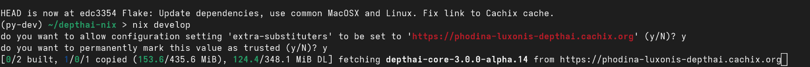

# Nixpkgs DepthAIv3 

> Updated to the latest V3 alpha 15 release


This repository provides a template for using DepthAIv3 packaged in the nixpkgs.

[Nixpkgs packaging request](https://github.com/NixOS/nixpkgs/issues/292618)

## Install Nix on the system

Follow the [guide](https://nixos.org/download/) to setup Nix on the Linux or MacOSX system.

On NixOS system this section will be skipped as it's already configured.

## Enable Nix features

Edit the Nix config file `~/.config/nix/nix.conf` (for user) or `/etc/nix/nix.conf`:
```
experimental-features = nix-command flakes
```

Then restart the daemon to take the new configurtion into account.
```
sudo systemctl stop nix-daemon
sudo systemctl start nix-daemon
```

# Create Development environment
## Nix Flake

Copy the `flake.nix` (optionally also the `flake.lock`) to project directory.

To update the dependencies run the `nix flake update`. This command downloads from git the latest revision and updates the `flake.lock` file.

## Development environment

To enter the development environment run the following `nix develop`. This creates the environment based on your specification.

There's a hint to use binary cache on Cachix.org provided by [myself](https://github.com/phodina). Until upstreamed you'd have to build it manually on local machine. Also there might be some development versions available.

```
nix develop
do you want to allow configuration setting 'extra-substituters' to be set to 'phodina-luxonis-depthai.cachix.org' (y/N)? y
do you want to permanently mark this value as trusted (y/N)? y
do you want to allow configuration setting 'extra-trusted-public-keys' to be set to 'phodina-luxonis-depthai.cachix.org-1:5GSc05BoSuEyBf0ifMQzu4bUUiE8QUJRiGFRxxD+/Yc=' (y/N)? y
do you want to permanently mark this value as trusted (y/N)? y
Python development environment activated
Python version: Python 3.12.9
Python path: /home/pethod/Luxonis/depthai-nix/.venv/bin/python
(py-dev) ~/Luxonis/depthai-nix > python3
Python 3.12.9 (main, Feb  4 2025, 14:38:38) [GCC 14.2.1 20241116] on linux
Type "help", "copyright", "credits" or "license" for more information.
>>> import depthai as dai
>>> print(dai.__version__)
3.0.0-alpha.14
```

# Misc
## Tmux
To run some task for longer time on remote machine you can use [tmux](https://github.com/tmux/tmux/wiki/Getting-Started).

There's also configuration file [.tmux.conf](./.tmux.conf) which could be used and placed in `~/`

## Package search

To find the packages you'd like to add you can search for them [here](https://search.nixos.org/packages)

## Binary caching

Nixos allows to build packages from sources, however, that would take long time and require lot of resources. Therefore it also allows to specify the machine that holds prebuild packages.

[Cachix.org](https://docs.cachix.org/installation) is used to provide cached builds for Linux and MacOSX - `depthaiv3_features`.




## Remote building

Similiarly the Nix daemon allows you to offload the build from you machine to another remote machine running Nix daemon and later just download the built package.

Setup nix daemon to build depthai on desktop in the office - TBD
Apple Silicon setup - TBD

## Copying the prebuild package

Nix also allows you to simply transfer built package to another machine. So it's like manual binary cache.

Give example how to do that - TBD

## Upstreaming
- [x] [apriltag](https://github.com/NixOS/nixpkgs/pull/392308)
- [x] [xlink](https://github.com/NixOS/nixpkgs/pull/392352)
- [ ] [libnop](https://github.com/NixOS/nixpkgs/pull/393017)
- [ ] [neargye-semver](https://github.com/NixOS/nixpkgs/pull/393018)
- [ ] [cpr](https://github.com/NixOS/nixpkgs/pull/393020)
- [ ] [ws-protocol](https://github.com/NixOS/nixpkgs/pull/393027)
- [ ] [fp16](https://github.com/NixOS/nixpkgs/pull/393036)
- [x] [xtensor](https://github.com/NixOS/nixpkgs/pull/393992)
- [ ] [pangolin](https://github.com/NixOS/nixpkgs/pull/393990)

## DepthAI patches
- [ ] [Hunter as optional dependency and skip download of files if they are already downloaded](https://github.com/luxonis/depthai-core/pull/1303)

## TBD
- [ ] [depthai-data](https://github.com/phodina/depthai-data)
  - solve manily Licenses of the files 
  - maybe move under Luxonis git repo
- [ ] [depthai-core](https://github.com/phodina/nixpkgs/commits/depthaiv3_upstream/)
  - solve the list of patches that need to be applied
  - split into generic part and then create different version of the package - core C/C++, Python, w/ OpenCV
  - when linking examples in parallel it requires to much memory !!!
- [ ] basalt
